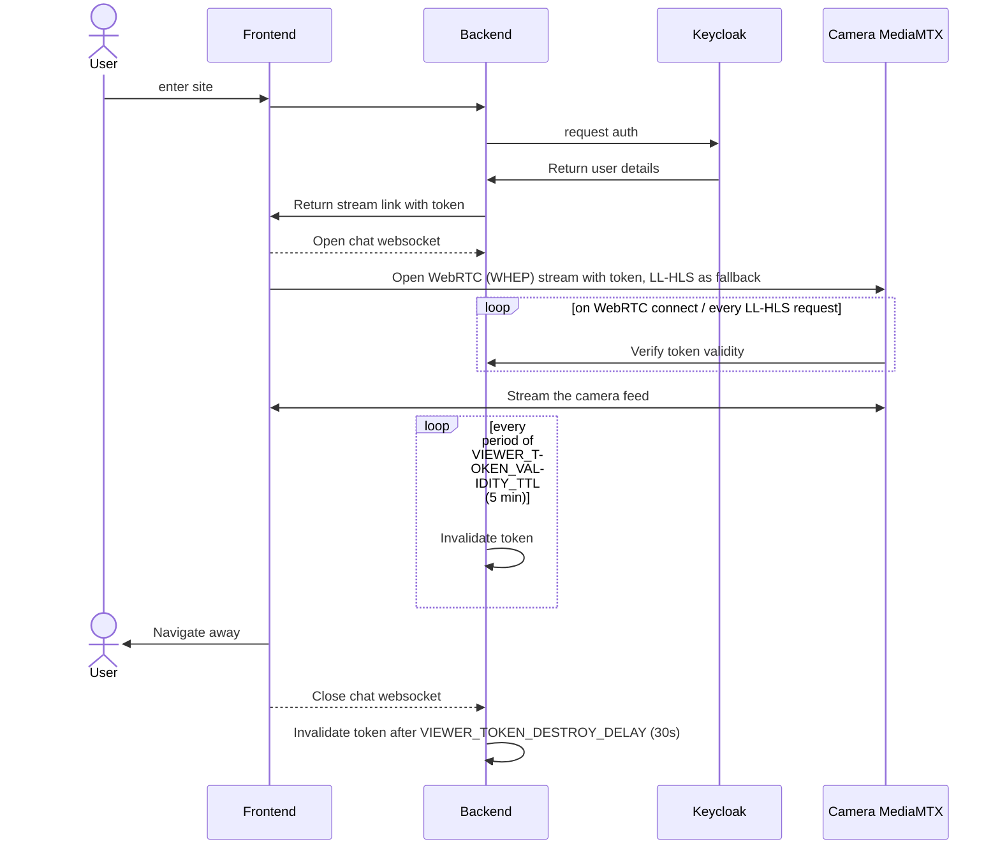

```mermaid

sequenceDiagram
    actor User
    User->>Frontend: enter site
    Frontend->>Backend: 
    Backend->>Keycloak: request auth
    Keycloak->>Backend: Return user details
    Backend->>Frontend: Return stream link with token
    Frontend-->>Backend: Open chat websocket
    Frontend->>Camera MediaMTX: Open WebRTC (WHEP) stream with token, LL-HLS as fallback
    loop on WebRTC connect / every LL-HLS request
        Camera MediaMTX->>Backend: Verify token validity
    end
    Camera MediaMTX<<->>Frontend: Stream the camera feed
    loop every period of VIEWER_TOKEN_VALIDITY_TTL (5 min)
        Backend->>Backend: Invalidate token
    end
    destroy User
    Frontend->>User: Navigate away
    Frontend-->>Backend: Close chat websocket
    Backend->>Backend: Invalidate token after VIEWER_TOKEN_DESTROY_DELAY (30s)
```

